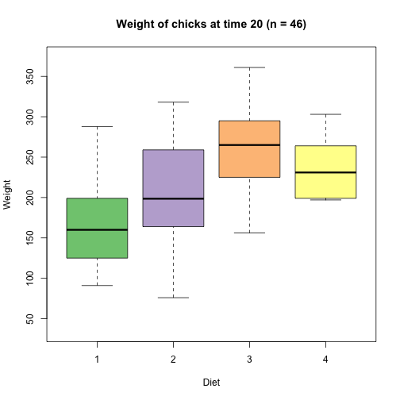

## Why Fat birds?

Do you enjoy watching data move about a chart at the click of a button, without getting into the code?
How about simulating the fattening of cute little fluffy chicks?

Then this app is for you!

---

## Why Fat birds? (cont.)

This app, hosted on ShinyApps.io at https://derekroger.shinyapps.io/fatbirds/, allows you to interact with a numeric toggle button and dynamically update a box plot.

You're able to choose the specific point in time to show the distribution of chicks' weights, for each of the four diets.

---

## Under the hood

The code to generate the box plots is below, for an example time point 20. Note the actual code differs slightly to facilitate user input.


```r
library(RColorBrewer)
data(ChickWeight)
ymin <- min(ChickWeight$weight); ymax <- max(ChickWeight$weight)
colDiet <- brewer.pal(length(unique(ChickWeight$Diet)),"Accent")
time = 20

df <- ChickWeight[ChickWeight$Time==time,]
n <- nrow(df)

plot(df$Diet, df$weight, col=colDiet, 
     xlab="Diet", ylab="Weight", 
     main=paste0("Weight of chicks at time ",time," (n = ",n,")"),
     ylim=c(ymin,ymax)
)
```

---

## Under the hood (cont.)

The distribution of chicks' weights for time point 20 is shown below.

 
